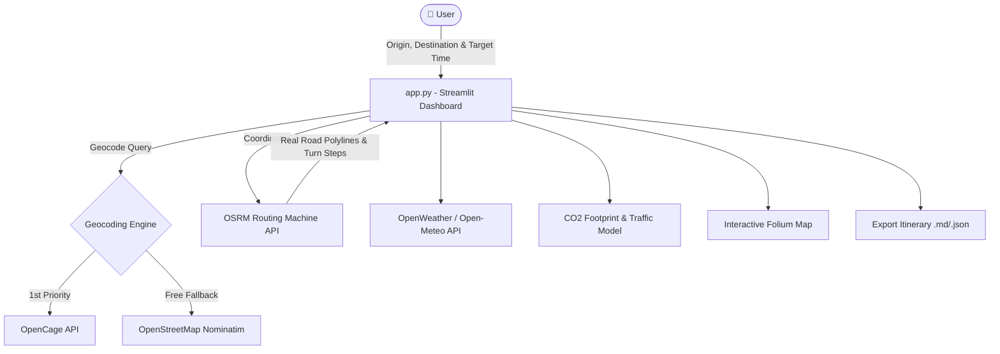

# 🚗 Smart Commute Assistant — Cuberto-Inspired Real-Road Mobility Engine

[](https://www.python.org/)
[](https://streamlit.io/)
[](http://project-osrm.org/)
[](https://python-visualization.github.io/folium/)
[](LICENSE)

An **elite, real-road commute intelligence platform and departure recommendation engine** built with **Python**, **Streamlit**, **OSRM (Open Source Routing Machine)**, **Folium**, and **OpenStreetMap**.

Designed with an **elite, Cuberto-inspired luxury beige UI aesthetic**, providing true highway/city road navigation, multi-modal transport comparison, peak-hour rush traffic estimation, turn-by-turn directions, and eco CO₂ footprint analytics.

---

## ✨ Key Features

- 🎨 **Cuberto-Inspired Luxury Beige Aesthetic**: High-contrast minimal design system (`#F7F4EF`), pill badges (`#E7E2D7`), sleek rounded cards, and elegant typography inspired by *Cuberto Digital Agency*.
- 🗺️ **OSRM Real Road Routing Engine**: Replaces straight-line distance math with real road geometry (GeoJSON polylines), actual turn-by-turn maneuvers, true driving distance, and exact road travel duration.
- 🚗 **Multi-Modal Transport Comparison**: Compare travel time, fuel costs, and carbon footprint across **Car 🚗**, **Motorcycle 🏍️**, **Public Transit 🚌**, **Bicycle 🚴**, and **Walking 🚶**.
- ⏱️ **Peak Traffic & Smart Departure Recommender**: Intelligent rush hour model (Morning 8-10 AM, Evening 5-8 PM) calculating exact recommended departure times based on desired target arrival schedules.
- 🌿 **Eco CO₂ Footprint Calculator**: Real-time carbon emission ($kg$ CO₂) and fuel cost estimates for selected transport modes vs green alternatives.
- 🌤️ **Live Weather Integration**: Origin and destination weather status with safety alerts.
- 📥 **1-Click Itinerary Export**: Export complete trip itineraries directly to **Markdown (.md)** or **JSON (.json)**.

---

## 🏗️ Architecture Overview



---

## 🛠️ Tech Stack & Dependencies

| Layer | Technologies Used |
| :--- | :--- |
| **Language & Core** | Python 3.10+ |
| **UI Framework** | Streamlit, Custom Cuberto CSS Design System |
| **Real Road Routing** | OSRM (Open Source Routing Machine) |
| **Geocoding & Maps** | Nominatim OpenStreetMap, OpenCage API, Folium, Streamlit-Folium |
| **Weather & Data** | OpenWeatherMap, Open-Meteo, Pandas |

---

## 💻 Local Installation & Setup

### 1. Prerequisites
Ensure you have Python 3.10 or higher installed.

### 2. Clone the Repository
```bash
git clone https://github.com/diyaapoulkar-alt/smart-commute-assistant.git
cd smart-commute-assistant
```

### 3. Install Dependencies
```bash
pip install -r requirements.txt
```

### 4. (Optional) Configure API Keys
Create a `.env` file in the project root (or copy `.env.example`):
```bash
cp .env.example .env
```
Add optional keys:
```env
OPENCAGE_KEY=your_opencage_key
OPENWEATHER_KEY=your_openweather_key
```
> 💡 *Note: If no API keys are supplied, the application automatically defaults to free OpenStreetMap Nominatim and Open-Meteo APIs.*

---

## 🚀 Running the Application

```bash
streamlit run app.py
```
Open `http://localhost:8501` in your browser.

---

## 📂 Project Structure

```text
smart-commute-assistant/
├── app.py                     # Streamlit Cuberto-Themed Dashboard & OSRM Engine
├── requirements.txt           # Managed Python dependencies
├── .env.example               # Environment variables template
├── SMART COMMUTE ASSISTANT.pdf# Project documentation PDF
└── readme.md                  # Comprehensive repository documentation
```

---

## 🤝 Contributing

Contributions, issues, and feature requests are welcome! Feel free to check the [issues page](https://github.com/diyaapoulkar-alt/smart-commute-assistant/issues).

---

## 📜 License

Distributed under the MIT License. See `LICENSE` for details.
